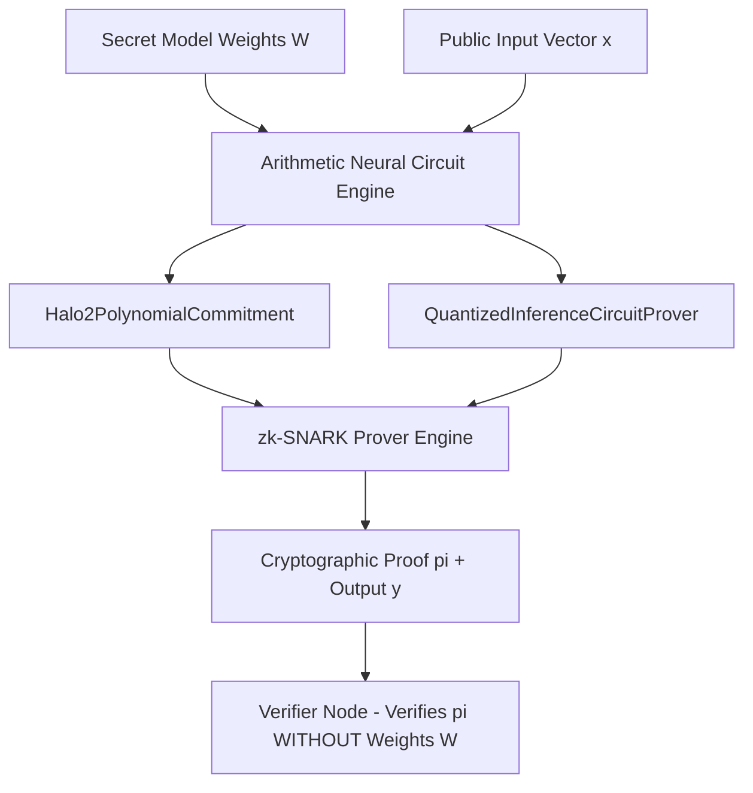

# Zero-Knowledge Machine Learning (zkML) Proof Generator 🔐 🧠

<div align="center">

[](https://opensource.org/licenses/MIT)
[](https://www.typescriptlang.org/)
[](https://zkproof.org)
[](https://github.com/anderdebona/zkml-zero-knowledge-neural-proofs)
[](https://github.com/anderdebona/zkml-zero-knowledge-neural-proofs/actions)

<br />

**PhD-Grade Zero-Knowledge Machine Learning (zkML) Engine with Halo2 Polynomial Commitments & Quantized Neural Circuits**

*Engineered by **[anderdebona](https://github.com/anderdebona)***

</div>

---

## 📌 Abstract & Research Goals

In confidential AI computation and decentralized verifiable inference, model providers must prove that a neural network output $y = f_W(x)$ was calculated using valid, non-tampered model weights $W$ **without revealing the private weights $W$**.

The **`zkml-zero-knowledge-neural-proofs`** implements an **Arithmetic Circuit Neural Representation Engine**, **Halo2/KZG Polynomial Commitments**, **INT8 Quantized Neural Proofs**, and a **Recursive SNARK / IVC Batch Verifier Protocol**.

---

## 🔬 Mathematical Formulation

Given secret weight vector $\mathbf{W} \in \mathbb{R}^n$, input vector $\mathbf{x} \in \mathbb{R}^n$, and bias $b \in \mathbb{R}$:

$$\text{Circuit Equation: } y = \left( \sum_{i=1}^n W_i \cdot x_i \right) + b$$

$$\text{KZG / Halo2 Polynomial Commitment: } C = [p(\tau)]_1, \quad \pi = \left[ \frac{p(\tau) - v}{\tau - z} \right]_1$$

---

## 🏛️ System Architecture



---

## ⚡ What's New in v4.0.0

- 📜 **`Halo2PolynomialCommitment`**: KZG / Halo2 polynomial evaluation opening proofs and tau basis evaluation.
- 🔢 **`QuantizedInferenceCircuitProver`**: INT8 fixed-point quantized circuit verification with overflow bounds checking.
- ⛓️ **`RecursiveSNARKComposer` & `BatchVerifier`**: Incrementally Verifiable Computation (IVC) chain aggregation.
- 🐙 **Automated Multi-Matrix CI/CD**: Full GitHub Actions test suites across Node LTS versions.

---

## 🚀 Quickstart & Installation

```bash
# Clone repository
git clone https://github.com/anderdebona/zkml-zero-knowledge-neural-proofs.git
cd zkml-zero-knowledge-neural-proofs

# Install dependencies
npm install

# Run automated tests
npm test

# Build & Run zkML Engine & Dashboard
npm run dev
```

Visit the interactive visual dashboard at: **`http://localhost:3011`**

---

## 🌟 Join the Community & Contribute

We are actively building the open standard for verifiable and trustless AI inference:
1. ⭐ **Star this repository** to support open-source zero-knowledge cryptography!
2. 🗺️ View our roadmap in [ROADMAP.md](./ROADMAP.md).
3. 💬 Propose new arithmetic circuits via [GitHub Issues](https://github.com/anderdebona/zkml-zero-knowledge-neural-proofs/issues).
4. 📜 Academic citation: see [CITATION.cff](./CITATION.cff).

---

<div align="center">

Distributed under the MIT License. Built with passion by **[anderdebona](https://github.com/anderdebona)**.

</div>
