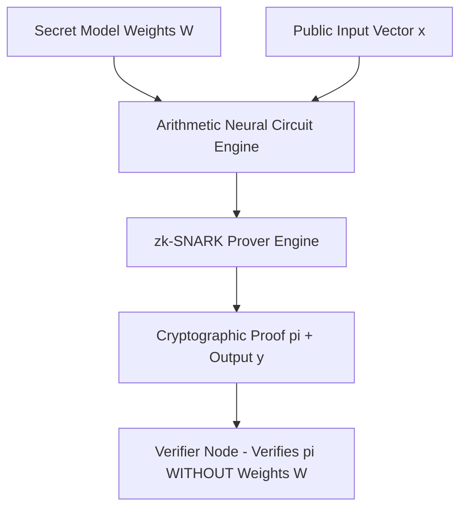

# Zero-Knowledge Machine Learning (zkML) Proof Generator 🔐 🧠

[](https://opensource.org/licenses/MIT)
[](https://www.typescriptlang.org/)
[](https://zkproof.org)

**Author:** anderdebona

---

## 📌 Abstract & Research Goals

In confidential AI computation and decentralized verifiable inference, model providers must prove that a neural network output $y = f_W(x)$ was calculated using valid, non-tampered model weights $W$ **without revealing the private weights $W$**.

The **`zkml-zero-knowledge-neural-proofs`** implements an **Arithmetic Circuit Neural Representation Engine**, **Pedersen/KZG Polynomial Commitments**, and a **zk-SNARK Prover/Verifier Protocol**.

---

## 🔬 Mathematical Formulation

Given secret weight vector $W \in \mathbb{R}^n$, input vector $x \in \mathbb{R}^n$, and bias $b \in \mathbb{R}$:

$$\text{Circuit Equation: } y = \left( \sum_{i=1}^n W_i \cdot x_i \right) + b$$

$$\text{Proof Commitment: } \pi = \text{Prover}(W, x, b) \implies \text{Verify}(\pi, y) = \text{true}$$

---

## 🏛️ System Architecture



---

## 🚀 Quickstart & Installation

```bash
# Clone repository
git clone https://github.com/anderdebona/zkml-zero-knowledge-neural-proofs.git
cd zkml-zero-knowledge-neural-proofs

# Install dependencies
npm install

# Build & Run zkML Engine & Dashboard
npm run dev
```

Visit the interactive visual dashboard at: **`http://localhost:3011`**

---

## 🧪 Automated Unit Testing

```bash
npm test
```

---

## 📜 Citation & License

```bibtex
@software{anderdebona2026zkml,
  author = {anderdebona},
  title = {Zero-Knowledge Machine Learning (zkML) Proof Generator},
  year = {2026},
  publisher = {GitHub},
  journal = {GitHub Repository},
  howpublished = {\url{https://github.com/anderdebona/zkml-zero-knowledge-neural-proofs}}
}
```

Licensed under the MIT License.
